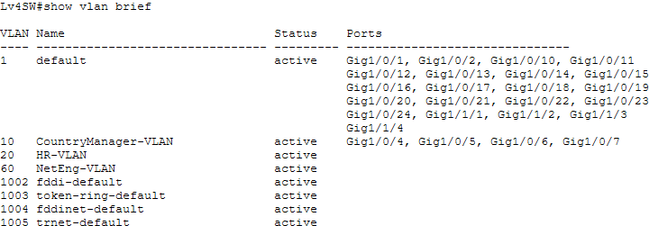
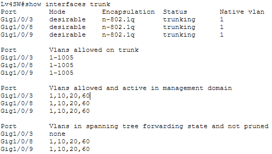
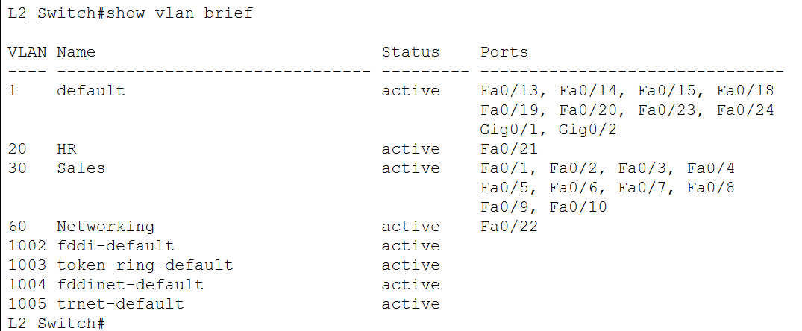
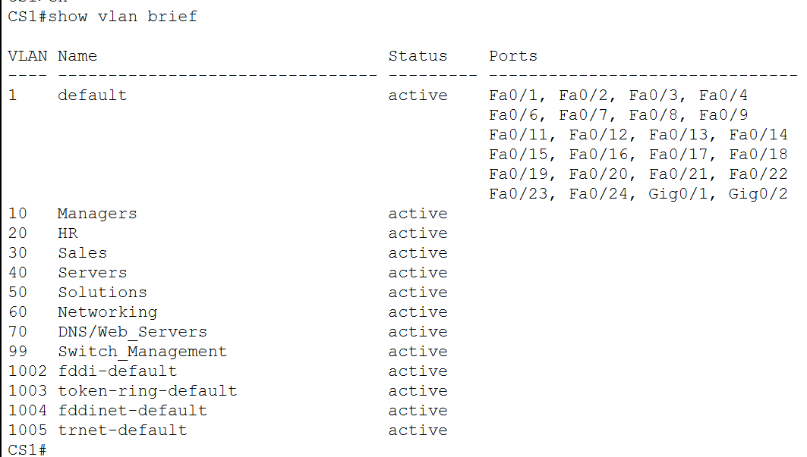
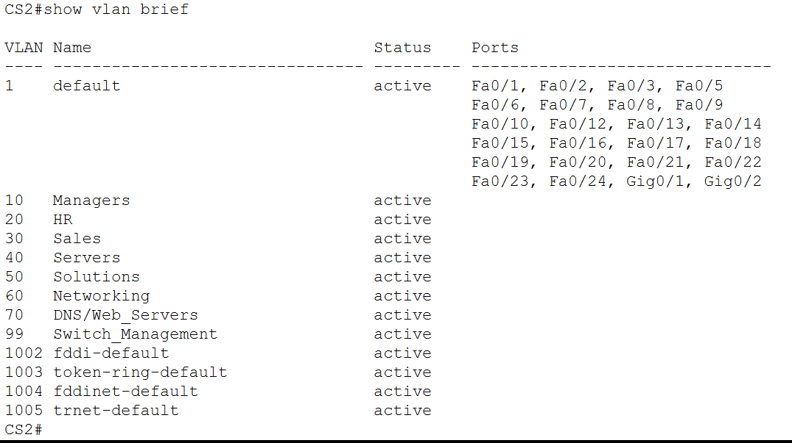

## Write your cmds / docs here if you want

So like 2 isp router
2 core switch
4 access
2 router and 6 switches, I just made like the base thingy

to do:
configure both core in server room to use Etherchannel to every other switch
https://xsite.singaporetech.edu.sg/d2l/le/enhancedSequenceViewer/189269?url=https%3A%2F%2Feb7d8702-81cc-4acd-8156-b72a5f076aca.sequences.api.brightspace.com%2F189269%2Factivity%2F907043%3FfilterOnDatesAndDepth%3D1

layer 3 to layer 3 channel between both core
https://xsite.singaporetech.edu.sg/d2l/le/enhancedSequenceViewer/189269?url=https%3A%2F%2Feb7d8702-81cc-4acd-8156-b72a5f076aca.sequences.api.brightspace.com%2F189269%2Factivity%2F903648%3FfilterOnDatesAndDepth%3D1

RSTP for both core switches
https://xsite.singaporetech.edu.sg/d2l/le/enhancedSequenceViewer/189269?url=https%3A%2F%2Feb7d8702-81cc-4acd-8156-b72a5f076aca.sequences.api.brightspace.com%2F189269%2Factivity%2F903649%3FfilterOnDatesAndDepth%3D1

create all switches in a trunk -> configure hsrp
https://xsite.singaporetech.edu.sg/d2l/le/enhancedSequenceViewer/189269?url=https%3A%2F%2Feb7d8702-81cc-4acd-8156-b72a5f076aca.sequences.api.brightspace.com%2F189269%2Factivity%2F903650%3FfilterOnDatesAndDepth%3D1

assign ip address for all devices

assign vlans where needed
country office vlan 10
marketiong vlan 20
networking dept vlan 30 -> should it access other vlans?
Service dept vlan 40
software dept vlan 50 -> Should it be allowed to access server?

make trunking and vlans accordingly
https://xsite.singaporetech.edu.sg/d2l/le/enhancedSequenceViewer/189269?url=https%3A%2F%2Feb7d8702-81tcc-4acd-8156-b72a5f076aca.sequences.api.brightspace.com%2F189269%2Factivity%2F903650%3FfilterOnDatesAndDepth%3D1

inter-vlan routing for isp routers
https://xsite.singaporetech.edu.sg/d2l/le/enhancedSequenceViewer/189269?url=https%3A%2F%2Feb7d8702-81cc-4acd-8156-b72a5f076aca.sequences.api.brightspace.com%2F189269%2Factivity%2F897107%3FfilterOnDatesAndDepth%3D1

ISP 1 g0/0 ISP 2 g0/0

r2 f0/0/1 f0/0/0 r1
r2(165) f0/0/0 f0/1 cs2(166)
r2(161) g0/1 f0/2 cs1(162)
cs2(157) f0/3/0 f0/2 r1(158)
cs1(154) f0/1 g0/1 r1(153)

Switch all vlan 99

level 4
**Changes Made (Alan):**

- Changed switch host name to "Lv4SW"
- VLAN 20 named to HR-VLAN
- VLAN 10 named to CountryManager-VLAN
- VLAN 60 named to NetEng-VLAN

**Commands done for switchport access: (VLAN 10)**

- switchport mode access
- swichport access vlan [ number ]

**Commands done for switchport trunking: (VLAN 20/VLAN 60)**

- switchport mode trunk
- switchport mode dynamic desirable

**Configured VLAN 10 for following interfaces:**

- G1/0/4
- G1/0/5
- G1/0/6
- G1/0/7

**Configured VLAN 20 for following interfaces:**

- G1/0/8
- G1/0/9

**Configured VLAN 60 for following interfaces:**

- G1/0/3

hr ex g1/0/9 v20 172.16.1.216/28
hr m g1/0/8 v20 172.16.1.215/28
dy cm g1/0/7 v10 172.16.1.3/26
s1 g1/0/6 v10 172.16.1.4/26
s2 g1/0/5 v10 172.16.1.5/26
cm g1/0/4 v10 172.16.1.6/26
net eng g1/0/3 v60 172.16.1.145/28

172.16.1.243
cs (meeting room) g1/0/1 f0/4 cs1
cs (meeting room) g1/0/13 f0/8 cs1
cs (meeting room) g1/0/14 f0/9 cs2
cs (meeting room) g1/0/2 f0/3 cs2

level 3
sol m f0/10 v50 172.16.1.227/28
s sol d1 f0/9 v50 172.16.1.228/28
s sol d2 f0/8 v50 172.16.1.229/28
net m f0/7 v60 172.16.1.142/28
net m f0/6 v60 172.16.1.143/28
s net eng f0/5 v50 172.16.1.230(144)/28 <- Why is bro in the Solutions developer VLAN?
hr ex f0/4 v20 172.16.1.214/28
web server f0/3 v70 172.16.1.131/29
dns cache f0/2 v70 172.16.1.132/29
dns server f0/1 v70 172.16.1.133/29
172.16.1.244
l3s f0/11 f0/3 cs1
l3s f0/16 f0/9 cs1
l3s f0/12 f0/6 cs2
l3s f0/17 f0/12 cs2

level 2 - Howard
**Create VLANs 20, 30, 60 on Access L2 Switch (Done)** 
**Create All VLANs on both distribution switches (Done)**  , 
**EtherChannel Access Switch L2 interfaces to both Distribution switches (Done)** 
L3 EtherChannel Distribution Switch 1 & 2 together 
Setting up SVI and interface IP for intervlan routing (idrg the ip table) Only able to do for VLAN 20 & 30
**Setup IP Addresses For Host devices on Level 2 (Done)**

level 2 (Sales Department Goons)
Network Engineer f0/22 v60 172.16.1.141/28
HR Executive f0/21 v20 172.16.1.213/28
Sales Manager f0/9 v30 172.16.1.68/26
Dy Sales Manager f0/8 v30 172.16.1.69/26
Sales Executive 1 f0/10 v30 172.16.1.70/26
Sales Executive 2 f0/7 v30 172.16.1.71/26
Sales Executive 3 f0/6 v30 172.16.1.72/26
Sales Executive 4 f0/5 v30 172.16.1.73/26
Sales Executive 5 f0/4 v30 172.16.1.74/26
Sales Executive 6 f0/3 v30 172.16.1.75/26
Sales Executive 7 f0/2 v30 172.16.1.76/26
Sales Executive 8 f0/1 v30 172.16.1.77/26
172.16.1.245 <- What it do?
Layer 2 Switch Interface f0/11 f0/5 Core Switch 1 Interface
Layer 2 Switch Interface f0/16 f0/10 Core Switch 1 Interface
Layer 2 Switch Interface f0/12 f0/4 Core Switch 2 Interface
Layer 2 Switch Interface f0/17 f0/11 Core Switch 2 Interface

level 1
172.16.1.246
l1s f0/16 f0/5 cs2
l1s f0/21 f0/10 cs2
l1s f0/15 f0/6 cs1
l1s f0/20 f0/11 cs1
Service m f0/9 v40 172.16.1.179/27
dy Service m f0/8 v40 172.16.1.180/27
hr ex f0/14 v20 172.16.1.212/28
net eng f0/13 v60 172.16.1.140/28
Service ex1 f0/10 v40 172.16.1.181/27
Service ex2 f0/7 v40 172.16.1.182/27
Service ex3 f0/6 v40 172.16.1.183/27
Service ex4 f0/5 v40 172.16.1.174/27
Service ex5 f0/4 v40 172.16.1.175/27
Service ex6 f0/3 v40 172.16.1.176/27
Service ex7 f0/2 v40 172.16.1.177/27
Service ex8 f0/1 v40 172.16.1.178/27
Service ex9 f0/11 v40 172.16.1.179/27
Service ex10 f0/12 v40 172.16.1.180/27

1. Point-to-Point routed links (keep your given IPs)
   Link Subnet Side A IP Side B IP
   R1 ↔ CS1 172.16.1.152/30 R1 172.16.1.153 CS1 172.16.1.154
   R1 ↔ CS2 172.16.1.156/30 CS2 172.16.1.157 R1 172.16.1.158
   R2 ↔ CS1 172.16.1.160/30 R2 172.16.1.161 CS1 172.16.1.162
   R2 ↔ CS2 172.16.1.164/30 R2 172.16.1.165 CS2 172.16.1.166

ISP links (you didn’t give IPs, so allocate next clean /30s):

ISP1 ↔ R2 g0/0 : 172.16.1.168/30 (R2=172.16.1.169, ISP1=172.16.1.170) (Change this)

ISP2 ↔ R1 g0/0 : 172.16.1.172/30 (R1=172.16.1.173, ISP2=172.16.1.174) (Change this)
VLAN Purpose Subnet Usable hosts
10 Managers / S1 / S2 / CM 172.16.1.0/26 62
30 Sales / SM group 172.16.1.64/26 62
70 DNS/Web_Servers 172.16.1.128/29 6
60 Networking Eng 172.16.1.136/28 14
(reserved) routed links + ISPs 172.16.1.152–175 (your P2P + ISP)
40 Server VLAN (expanded) 172.16.1.176/27 ✅ 30
20 HR 172.16.1.208/28 14
50 Solutions + related 172.16.1.224/28 14
99 Switch_Management + native 172.16.1.240/28 14

L3 Etherchannel 
CS1 INT F0/7 F0/7 INT CS2
CS1 INT F0/12 F0/8 INT CS2

Comments abt packet tracer files 
1. instead of using a l3 switch as it is confusing for level 4, we trunk 2 l2 switches to simulate a 48 port l2 switch
2. We are missing 2/5 hosts in our solutions department, i added that in already
3. Interfaces are a lil messy but it works properly.

Redo VLAN & Subnetting from Biggest to smallest
/26 - 255.255.255.192
/27 - 255.255.255.224
/28 - 255.255.255.240
/29 - 255.255.255.248

(I addded vlan 10 in case we need IPs for the people in the meeting room. Safety measures xD)
VLAN 10 (Meeting_RMs)/26 -  28+6+3 hosts |  Uses 37/64 Addresses 
1st IP - 172.16.1.0
HSRP vIP - 172.16.1.1
CS1 IP - 172.16.1.2
CS2 IP - 172.16.1.3
hosts (34) - 172.16.1.4-36
last IP - 172.16.1.63

VLAN 20 (CS)/27 - 12+3 hosts Uses | 17/32 ADdresses
1st IP - 172.16.1.64
HSRP vIP - 172.16.1.65
CS1 IP - 172.16.1.66
CS2 IP - 172.16.1.67
hosts (12) - 172.16.1.68-79
last IP - 172.16.1.95

VLAN 30 (Marketing)/28 -  needs 10+3 | Uses 15/16 addresses
1st IP - 172.16.1.96
HSRP vIP - 172.16.1.97
CS1 IP - 172.16.1.98
CS2 IP - 172.16.1.99
hosts (10) - 172.16.1.100-109
last IP - 172.16.1.111

VLAN 40 (Networking)/28 - Needs 6+3 | Uses 11/16 addresses
1st IP - 172.16.1.112
HSRP vIP - 172.16.1.113
CS1 IP - 172.16.1.114
CS2 IP - 172.16.1.115
hosts(6) - 172.16.1.116-121
last IP - 172.16.1.127

VLAN 50 (Solutions)/28 - Needs 5+3 | Uses 10/16 addresses 
1st IP - 172.16.1.128
HSRP vIP - 172.16.1.129
CS1 IP - 172.16.1.130
CS2 IP - 172.16.1.131
hosts(5) - 172.16.1.132-136
last IP - 172.16.1.143

VLAN 60 (HR)/28 - Needs 5+3 | Uses 10/16 addresses
1st IP - 172.16.1.144
HSRP vIP - 172.16.1.145
CS1 IP - 172.16.1.146
CS2 IP - 172.16.1.147
hosts(5) - 172.16.1.148-152
last IP - 172.16.1.159

VLAN 70 (Managers)/28 - Needs 4+3 | Uses 9/16 addresses
1st IP - 172.16.1.160
HSRP vIP - 172.16.1.161
CS1 IP - 172.16.1.162
CS2 IP - 172.16.1.163
hosts(4) - 172.16.1.164-167
last IP - 172.16.1.175

VLAN 99 (Switch_MGM) - Assume up to 16 hosts might be needed /28
1st IP - 172.16.1.176
HSRP vIP - 172.16.1.177
CS1 IP - 172.16.1.178
CS2 IP - 172.16.1.179
hosts(11) - 172.16.1.180-190
last IP - 172.16.1.191

VLAN 80 (Servers)/29 - Needs 3+3 | Uses 8/8 Addresses
1st IP - 172.16.1.192
HSRP vIP - 172.16.1.193
CS1 IP - 172.16.1.194
CS2 IP - 172.16.1.195
hosts(3) - 172.16.1.196-198
last IP - 172.16.1.199

Non VLAN Ips
172.16.1.204-255 Free to use for other purposes.

172.16.1.201/202 for L3 etherchannel

11 - 4(1) - 6 = f = 1 | 4f = last octet of assigned address block interface of your edge router connecting to ISP1 172.17.9.4/30
router to isp = first usable
230.149.210.8/28 = public IP address block for ISP1 

address block 172.17.10.XX
129.126.142 + [8f // 256].296%256 = public IP for ISP2 

I abandoned the mesh design because

1️⃣ STP behavior (this alone is a huge win)
First design (mesh-heavy)

Many Layer-2 paths

STP must block lots of links

Small config mistake → broadcast storm

Root changes can ripple everywhere

Debugging is painful (“why is this link blocked?”)

Second design (clean access → dist)

Clear STP root (Dist1 primary, Dist2 secondary)

Only one loop per access block

Blocked ports are expected

Failure behavior is deterministic

Benefit:
You can predict which link forwards and which blocks.

2️⃣ Failure domains (blast radius)
First design

One bad trunk can affect multiple departments

STP reconvergence touches large parts of the network

A loop can melt the whole LAN

Second design

Each access switch is its own failure domain

Problems stay local

Dist layer absorbs failures cleanly

Benefit:
When something breaks, fewer people are affected.

3️⃣ Operational complexity (day-2 reality)
First design

You must manage:

STP tuning everywhere

VLAN pruning on many links

Port-channel consistency

Cross-switch dependencies

Second design

You manage:

Standard trunk templates

HSRP/VRRP once per VLAN

STP root in one place

Benefit:
Easier changes, fewer outages, junior engineers won’t kill it accidentally.

4️⃣ Redundancy that actually matters
First design

Many links exist…

…but STP blocks most of them

Extra cables give illusion of resilience

Second design

One active + one standby uplink per access switch

Failover is fast and intentional

Redundancy is real, not cosmetic

Benefit:
Redundancy that works the way you expect.

5️⃣ Scalability
First design

Adding a new access switch:

Multiple trunks

VLAN propagation concerns

STP recalculation risk

Second design

Add access switch:

2 uplinks

Done

Benefit:
Network grows linearly instead of exponentially in complexity.

6️⃣ Security & segmentation
First design

VLANs stretch everywhere

Easier lateral movement

Harder to contain misconfigs

Second design

VLANs terminate at distribution

ACLs / policies centralized

Easier to implement Zero Trust later

Benefit:
Much safer foundation.

7️⃣ Performance (counter-intuitive but true)
First design

More links ≠ more bandwidth

STP blocks many paths

Traffic hairpins unpredictably

Second design

Known traffic paths

No surprise blackholes

Easier QoS and monitoring

Benefit:
Performance you can reason about.

8️⃣ Real-world credibility (important for exams & interviews)

If you showed both diagrams to a senior network engineer:

First diagram →
“Why is this so complicated? What problem are you solving?”

Second diagram →
“Yep. Standard collapsed core. Sensible.”

Benefit:
Second design aligns with Cisco validated designs, exams, and industry norms.

### To run dns
 python -m http.server 80
 python new.py

 with admin go to C:\Windows\System32\drivers\etc\hosts
 C:\Windows\System32\drivers\etc\hosts
